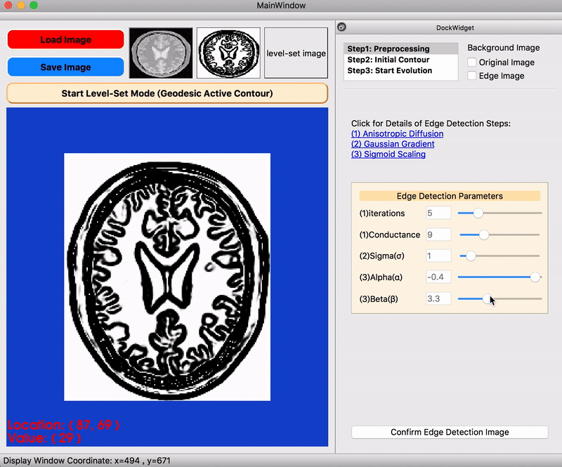
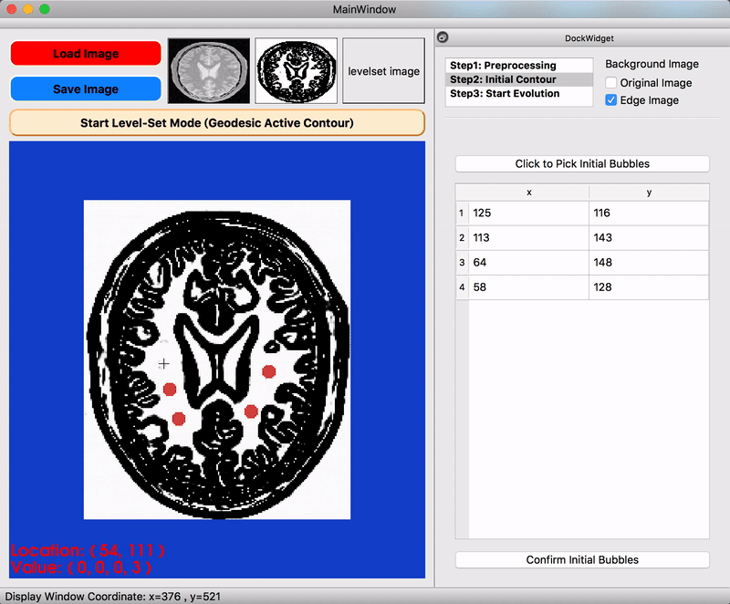
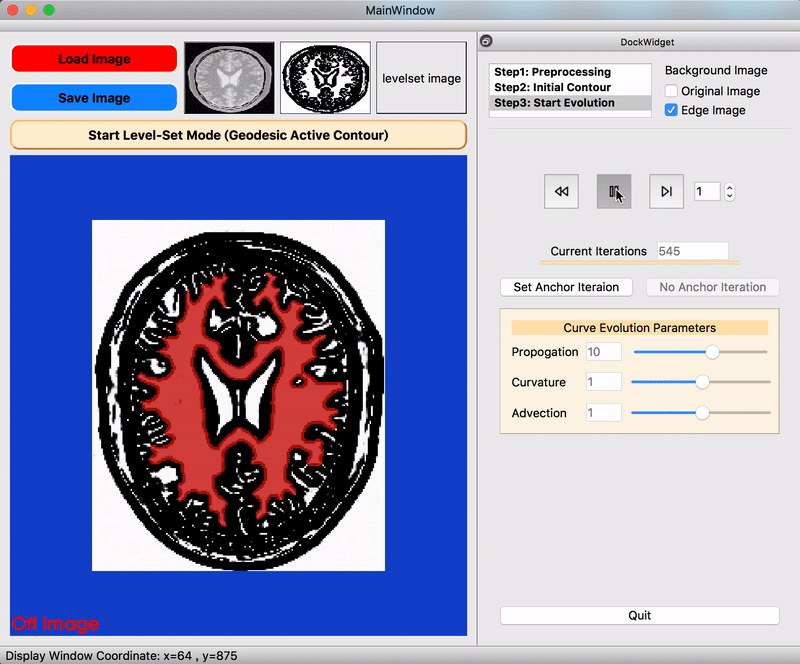
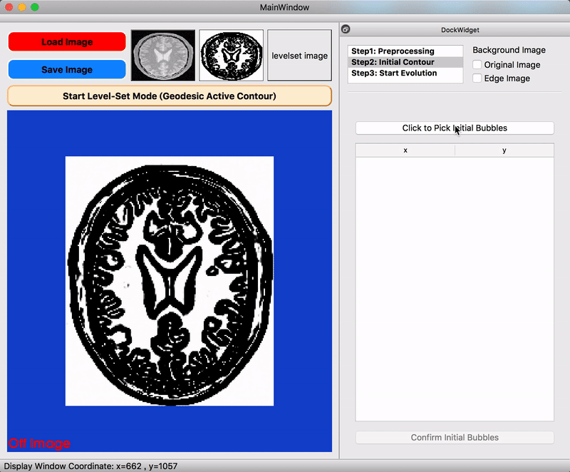
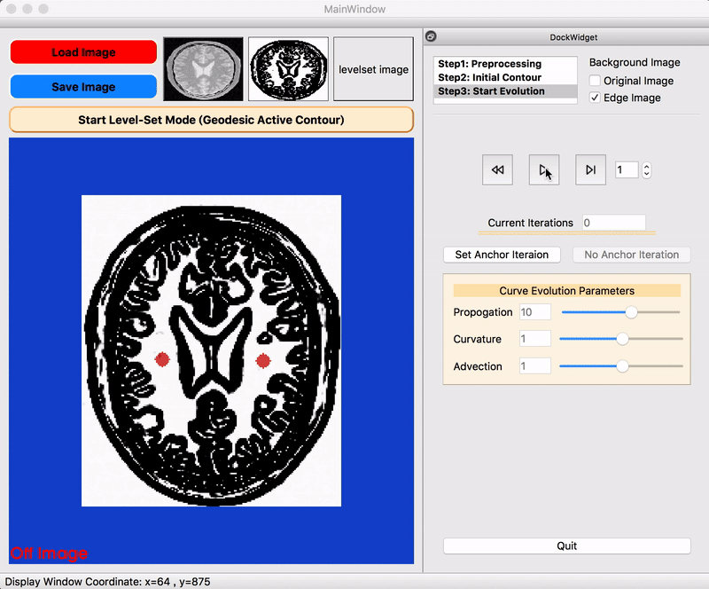

<p align="center">
  <a href=#>
    
  </a>
  <h2 align="center">Level-Set Visualizer</h2>
  <div align="center">
    Visualize image segmentation based on level set method.
  </div>
</p>

<p align="center">
 	<a href=#>
		
		
		
	</a>
</p>


## Table of contents
* [Application Demo](#application-demo)
* [Introduction](#introduction)
* [Built With](#built-with)
* [Installation](#installation)
* [Acknowledgments](#acknowledgments)

## Application Demo
### [Level-Set Visualizer – Demo (YouTube)](https://www.youtube.com/watch?v=uTrr98JsRps)

## Introduction
This application perform image segmentation by following steps:

* Load Image & Start Level-Set Mode
* Preprocessing
* Initial Contour
* Start Evolution


### Preprocessing
- Edge detection by [Anisotropic Diffusion](https://itk.org/Doxygen/html/classitk_1_1CurvatureAnisotropicDiffusionImageFilter.html), [Gaussian Gradient](https://itk.org/Doxygen/html/classitk_1_1GradientMagnitudeRecursiveGaussianImageFilter.html), [Sigmoid Scaling](https://itk.org/Doxygen/html/classitk_1_1SigmoidImageFilter.html)
- Control over some edge detection parameters


<p align="center">
    
</p>

### Initial Contour
- Done by [Fast Marching](https://itk.org/Doxygen/html/classitk_1_1FastMarchingImageFilter.html), support multiple bubbles
<p align="center">
    
</p>

### Start Evolution
- Support media-like control (play/pause/step/rewind) & anchor iteration
- Control over 3 parameters based on [Geodesic Active Contour (GAC)](https://itk.org/Doxygen/html/classitk_1_1GeodesicActiveContourLevelSetImageFilter.html)
<p align="center">
    
</p>

## Built With


 * [ITK 4.12](https://itk.org/ITK/resources/legacy_releases.html) - Image Processing Algorithms (w/ module `ITKVtkGlue`)
 * [VTK 8.2](https://vtk.org/download/) - Image Display
 * [Qt 5.6](https://doc.qt.io/archives/qt-5.6/index.html) - GUI framework

## Installation

Before running the following command, modify `QT_HOME`, `ITK_DIR`, and `VTK_DIR` in [CMakeLists.txt](https://github.com/wenyalintw/Level-Set-Visualizer/blob/master/src/CMakeLists.txt)

```sh
$ mkdir build
$ cd build
$ cmake ../src
$ make -j4
```

## Acknowledgments
- This application is inspired by [ITK-SNAP](http://www.itksnap.org/pmwiki/pmwiki.php)
- Processing pipeline & [test.png](https://github.com/wenyalintw/Level-Set-Visualizer/tree/master/src/test.png) modified from [ITK GAC Example](https://itk.org/ITKExamples/src/Segmentation/LevelSets/SegmentWithGeodesicActiveContourLevelSet/Documentation.html)
- [heart.png](https://github.com/wenyalintw/Level-Set-Visualizer/tree/master/resources/heart.png) modified from [ICONFINDER](https://www.iconfinder.com/icons/44697/cardiology_heart_organ_icon)

###### MIT License (2019), Wen-Ya Lin

